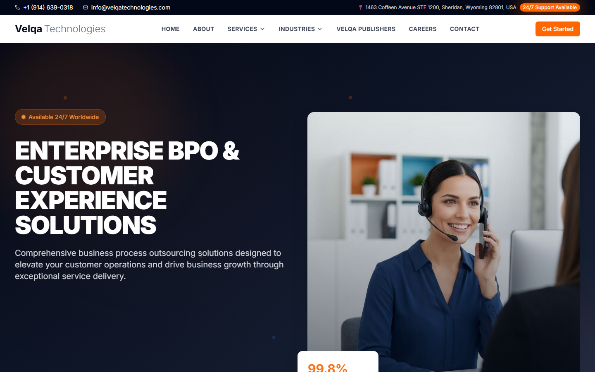

# Velqa Technologies

Marketing site for **Velqa Technologies LLC**, a BPO and customer-experience
company with teams in the USA and Pakistan. It covers 13 service lines,
6 industry verticals, a careers page and the Velqa Publishers imprint, and
every page is statically generated.

**Live:** (https://velqatechnologies.com)


[](https://github.com/Muhammadhammad24/velqatechnologies/actions/workflows/ci.yml)



## Highlights

- **Fully static.** `output: "export"` pre-renders all 33 routes to plain HTML,
  so the site is served from the CDN edge with no server to run.
- **SEO.** Typed `Metadata` per page, a canonical `metadataBase`, Open
  Graph and Twitter cards, and a `sitemap.xml` and `robots.txt` generated in
  `app/`.
- **Content as components.** Each service and industry page follows one
  layout, so adding a service line takes one route file.
- **Accessible UI primitives.** Radix-based components with keyboard and
  screen-reader support, styled with Tailwind.
- **Cookieless analytics** through Vercel Analytics.

## Site map

```
/                         home
/about                    mission, timeline, global presence
/services                 13 service lines (call center, live chat, email,
                          technical support, back office, CX quality, …)
/industries               e-commerce, SaaS, healthcare, finance,
                          marketplaces, digital products
/velqa-publishers         publishing imprint and book showcase
/careers  /contact  /privacy  /terms
```

## Development

```bash
npm ci
npm run dev      # http://localhost:3000
npm run build    # static export to out/
npm run lint
```

## Project structure

```
app/            routes, metadata, sitemap and robots
components/
  home/         hero, services overview, stats, industries, CTA
  about/ services/ industries/ careers/ contact/ layout/
  ui/           Radix-based primitives
hooks/          shared React hooks
public/         images and static assets
```

## Deployment

Pushes to `main` deploy to production on Vercel; pull requests get preview
URLs. CI type-checks, lints and builds every push first.
